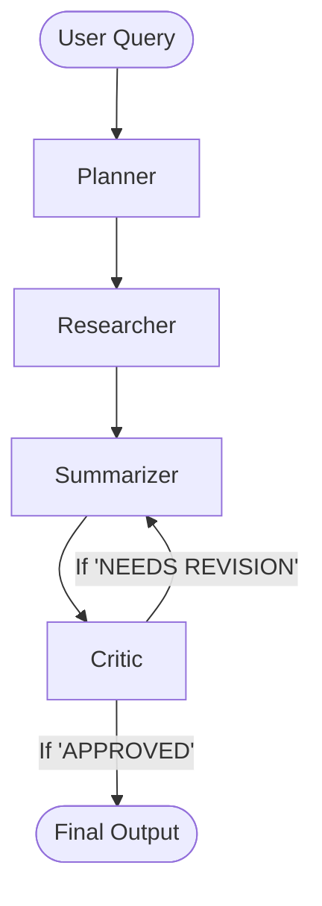

# Multi AI Agent 🧠
A production-ready Multi AI Agent System built with LangGraph, LangChain, Groq (LLaMA-3.1), and FastAPI, featuring a beautiful Streamlit UI.

[](https://multiaiagent-cmcvrlaop2yjv9twjpsusv.streamlit.app/)
[](https://render.com/deploy?repo=https://github.com/ShivanshPandey2005/multi_ai_agent)

## 🌟 Features
- **LangGraph Stateful Workflow**: A robust graph that coordinates multiple specialized agents.
- **Planner Agent**: Breaks complex user queries into logical research steps.
- **Researcher Agent**: Tool-enabled agent that searches the web (via Serper).
- **Summarizer Agent**: Synthesizes the final answer.
- **Critic Agent & Revision Loop**: Reviews the answer for accuracy and completeness. Prompts revisions if the answer is inadequate.
- **FastAPI Backend**: A highly performant async API (`/ask`).
- **Streamlit Frontend**: A sleek, modern chat interface.
- **Docker Ready**: One-command deployment via Docker Compose.

## 🏗️ Architecture
The system uses LangGraph to manage the control flow between agents.



## 🚀 Setup & Installation

### Option 1: Using Docker (Recommended)
1. Ensure Docker and Docker Compose are installed.
2. Clone this repository or copy the files.
3. Open the `.env` file and insert your API keys:
   ```env
   GROQ_API_KEY=your_groq_key_here
   SERPER_API_KEY=your_serper_key_here
   ```
4. Run the application:
   ```bash
   docker-compose up --build
   ```
5. Open your browser and navigate to **http://localhost:8501** for the UI. (The API is at `http://localhost:8000`).

### Option 2: Local Python Environment
1. Install dependencies:
   ```bash
   pip install -r requirements.txt
   ```
2. Update the `.env` file with your API keys.
3. Start the FastAPI Server:
   ```bash
   python main.py
   ```
4. In a new terminal, start the Streamlit UI:
   ```bash
   streamlit run ui/app.py
   ```
5. Access the UI at **http://localhost:8501**.

### Option 3: Streamlit Community Cloud (Fastest)
1. Fork or push this repository to your GitHub account.
2. Go to [Streamlit Cloud](https://share.streamlit.io/) and create a new app from your repository.
3. Set the **Main file path** to `streamlit_app.py`.
4. In the App Settings, go to **Secrets** and add:
   ```toml
   GROQ_API_KEY = "your_groq_key"
   SERPER_API_KEY = "your_serper_key"
   ```
5. Click **Deploy**!

## 🧪 Testing the API
You can test the FastAPI backend directly using the included test script:
```bash
python test_api.py
```
